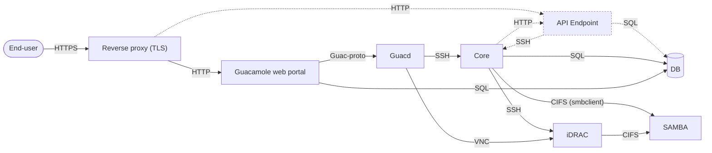

# Giif - Guacamole-inspired infrastructure framework

An easy-to-set-up and modular IaaS framework built on [Apache Guacamole](https://guacamole.apache.org/doc/gug/index.html).

- [Giif - Guacamole-inspired infrastructure framework](#giif-guacamole-inspired-infrastructure-framework)
  - [Brief introduction](#brief-introduction)
  - [End-user perspective](#end-user-perspective)
    - [Registration](#registration)
    - [Post-registration workflow](#post-registration-workflow)
    - [Different ways to access your resources](#different-ways-to-access-your-resources)
      - [Console access](#console-access)
      - [IP connectivity](#ip-connectivity)
        - [Wireguard access](#wireguard-access)
        - [PPTP access](#pptp-access)
    - [Reservation model](#reservation-model)
  - [Operator's perspective](#operators-perspective)
    - [Network requirements](#network-requirements)
      - [Public plane](#public-plane)
      - [Control plane](#control-plane)
      - [Project-management segments](#project-management-segments)
      - [BMS connectivity plane](#bms-connectivity-plane)
      - [Data plane](#data-plane)
    - [Server requirements](#server-requirements)
      - [PAGW-host](#pagw-host)
      - [Main application](#main-application)
        - [Guacamole](#guacamole)
        - [Reverse proxy](#reverse-proxy)
        - [SAMBA share](#samba-share)
        - [Core](#core)
        - [API Endpoint](#api-endpoint)
        - [Environment file](#environment-file)
        - [Defining PAGW slots](#defining-pagw-slots)
        - [Creating and starting the main application](#creating-and-starting-the-main-application)
        - [Default project](#default-project)
        - [Managing user projects](#managing-user-projects)
      - [Resource types and their drivers](#resource-types-and-their-drivers)

## Brief introduction

**Giif** is a minimalistic BMS (bare-metal server) and virtual machine (VM) hosting platform, suitable for small and medium-sized IaaS cloud providers and research projects.

Because of its modular design, **Giif** can be easily extended to support a large number of different hardware vendors and virtualization technologies. It can also branch out to other areas, such as network and storage provisioning, or user account management.

The framework centers around [Apache Guacamole](https://guacamole.apache.org/doc/gug/index.html) as its key component. The extensive list of involved technologies is given in a separate `Technology-tags.md` file.

**Giif** strives to reduce its dependence on custom implementations with traditional programming languages like Java or Python. Instead, it almost entirely relies on standard sysadmin tools (e.g., Bash scripting) and readily available components, such as official Docker images for the Guacamole service.  

`Note:` One exception where conventional programming languages are unavoidable is the implementation of the (REST) API endpoint. This componenet of the framework is, however, still in its early planning phase.

To see **Giif** in action and to get a quick idea of how it operates, please take a look at [Giif's playlist on YouTube](https://www.youtube.com/playlist?list=PL7vyQ5g-ZQEP2B1YU5Cg7PQatx-g-g9ei). The rest of this markdown guide describes the framework in more details. 

## End-user perspective

This section describes the services provided by the framework from a user's point of view.

### Registration

The registration process is by design decoupled from (i.e., not part of) the framework itself. Each institution or deployment can enforce its own registration policies (federated identity checks, e-mail/phone number verifications, and so on). Regardless of the methods and policies involved, the registration process has to provide a clear-cut outcome, telling the framework which users have been successfully enrolled and which should not be granted with any kind of access to it.

### Post-registration workflow

At any point in time, a registered user can request one or more projects. If approved by the operators, the user becomes the owner of these projects. Also, for each approved project, a separate PAGW instance (Project-access Gateway) is spawned. PAGW acts as a sort-of a home router, providing DHCP, NAT and VPN functionality to the project and its resources. 

The exact details will change as the service evolves, but in general, a project owner should be able to perform the following actions:

- Reserve or release resources such as BMS (Bare-metal servers), VMs and network links.
- Ask for an extension of the project expiration date.
- Invite other registered users to participate in the project, as well as to manage their access levels and permissions.

### Different ways to access your resources

There are two main ways in which a user can access any of the available resources (VMs, BMS and similar):

- Console access
- IP connectivity

The console mimics the physicial/OOB access and is often used for operations which cannot be achieved through direct IP connectivity. The most common applications of this type of access are:

- Root password recovery
- Adjustment of different BIOS and UEFI settings
- ISO image manipulation
- Operating system installation
- Power management
- RAID and NIC firmware setups 

The other kind of access is possible through IP connectivity. It usually relies on a previously installed operating system and a higher-level protocol such as SSH, Telnet, HTTP, FTP or RDP. However, since all resources are connected to a private subnet (so called project-management segment) and thus hidden behind PAGW and its SNAT barrier, the user needs to authenticate against one of the PAGW-provided VPN servers before accessing the resources in this way. 

Both access methods are described more closely in the following subsections.
 
#### Console access

For console access, Guacamole web portal is used. [Guacamole](https://guacamole.apache.org/) is a free and open-source cross-platform maintained by the Apache Software Foundation. 

Registered users will at some point receive their Guacamole credentials. The items accessible to them within the portal will vary depending on the associated projects, as well as on the roles and permissions granted to them within these projects. 

Currently, the following Guacamole action items are available:

- Project toolbox 
  - ARP-Scan 
  - PPTP management
  - WireGuard management
- Resource level 
  - VGA output (e.g. redirected display for VMs and BMS)
  - Dashboard (power actions, ISO manipulation and other resource specific operations)
- Operator (super-admin) level only
  - Guacamole management
  - Factory defaults (for BMS)
  - Firmware reset (for BMS) 

`Note:` Depending on the specific drivers, certain items in the Dashboard can be subdivided further. For example, it's possible to categorize power and ISO actions separately.  

#### IP connectivity

Each project and its PAGW instance reside on a separate broadcast domain. These broadcast domains are collectively known as _project-management segments_. All projects use the same `192.168.212.0/24` private subnet, which is (almost) invariably baked into the common template from which all PAGW instances are eventually spawned. 

Individual `host-based` resources (i.e., VM and BMS instances) are dynamically attached to (and eventually released from) these broadcast domains as acquired by different projects. As mentioned earlier, the corresponding PAGW instance then acts as a DHCP server and a NAT gateway on the behalf of these resources. It is generally not allowed (nor practical) for a single `host-based` resource to be affiliated with more than one project at the same time.

DHCP server pool is configured for the `192.168.212.20 - 192.168.212.120` range, but the operators are free to change this on a per-project basis. The use of static address assignment is also possible; the recommended range for this is `192.168.212.130 - 192.168.212.230`. In both cases, the default gateway (as configured on the PAGW host) is `192.168.212.1`. `ARP-Scan` can be used to determine the current IP assignment which can then be matched against the MAC addresses exposed through Guacamole.   

Obviously, each PAGW instance gets a different public IP address. These public IP addresses are used for masquerading of the `192.168.212.0/24` private subnets, as well as for the VPN access.

The private subnet `192.168.212.1/24` is practically hard-coded and cannot be changed easily. For that reason, make sure that you don't have any overlapping routes on your VPN client (which can easily happen if you try to connect to two or more projects at the same time).

##### Wireguard access

VPN account settings for WireGuard are initially empty.

A user can manage WireGuard accounts through Console if granted permissions to do so. The operators may decide not to grant this privilege to any user (not even to a project owner). In that case, the operators themselves can establish the user-requested accounts.   

The management of WireGuard accounts is enabled through simple editing of the appropriate server-side configuration file. When making changes to this file, the users are advised to:

- Double check their edits, as even a small typo can stop the VPN server from functioning properly.
- Read (and keep!) the instructions embedded in the comments. These contain useful instructions that need to be followed on both client and server ends.    

The operators can follow the history of the changes made to this file and in case of an emergency rollback to some of its previous versions.

##### PPTP access

Most of what has been said for WireGuard applies to PPTP as well.

WireGuard is a preferable VPN option to PPTP. However, some users may find PPTP to be simpler to use, especially from the Windows and Linux desktop environments.

### Reservation model

The reservation model is fairly simple. The expiration date is only applied on the project level and cannot be overriden nor specifically given for any of the individual resources (BMS, VMs or links). When a project reaches its expiration date, a notification is dispatched to the system operators and no further action is taken. In particular, there is no such thing as the automated cleanup of the infrastructure associated with the project. This allows projects to be easily extended beyond their original expiration dates and also avoids the dangers of post-cleanup "zombies" and potential reservation conflicts.

Only immediate reservations are supported; prescheduled (calendar) reservations (e.g., three months from now) are not allowed. The same rule applies for the release of individual resources. 

`Note:` This part of the framework is still in its early planning phase. No actual support for this has been provided yet.

## Operator's perspective

This section outlines the infrastructure setup and workflow procedures from the operator's angle. It is intended as a starting point for those who want to install, configure and operate their own instances of this framework.

### Network requirements

The setup relies on five types of networks:

- Public plane
- Control plane
- Project-management segments
- BMS connectivity plane
- Data plane links and connections  

The following subsections describe each of them in more details.

#### Public plane

Public plane is most commonly implemented as a single Internet routable subnet. The subnet should be large enough to accommodate the desired number of simultaneous projects (i.e., one address per each active PAGW instance) plus the following:

- Next hop addresss
- One address for the host running the `main application`
- One address for the exit/entry point of your control plane network
- A number of floating IP addresses 

The addressing pool allocated for projects and their PAGW instances is recyclable. When a project gets deleted, its public address becomes readily available for the next project in line. 

The next hop address is used as a default gateway for the hosts residing in the public plane. 

The host running the `main application` needs a public IP address in order to be able to expose the console access to its end-users. The application itself is prepackaged and delivered in the Docker Compose format.  

The purpose of an exit/entry point for the control plane is explained in the following section.

The concept of floating IP addresses is commonly found in many IaaS platforms. In essence, it enables our host-based resources (VMs and BMS) to become fully visible on the Internet, even though they are not directly attached to the public plane. The implementation relies on the PAGW instances and their dynamically configured 1-on-1 DNAT rules.

`Note:` The framework doesn't restrict operators from using more than one public subnet.

#### Control plane

Control plane is typically implemented as a single private subnet (e.g., 10.20.30.0/24). This network was introduced to safeguard infrastructure components from public exposure while still enabling them to access the Internet and communicate with each other.

To provide control plane components with Internet access, it is necessary to employ masquerading (SNAT) through one of the public plane addresses. Typically, operators can utilize the same "exit" address as their "entry" point to access the control plane, whether via VPN, port forwarding, SSH tunneling, or some other method.

#### Project-management segments

Project-management plane is a collection of isolated broadcast domains (along with their corresponding VLAN numbers). Each project gets exactly one of these domains. 

The operator must ensure that:

 - There is enough available segments to accommodate the desired number of active projects (one VLAN per each PAGW instance).
 - Segments are free of IP or any other type of configuration and traffic on them.

Each active project has its own PAGW instance with a different public plane address and a different project-management VLAN. Since every project sits on a different broadcast domain, no conflict can occur from using the same private subnet (i.e., `192.168.212.0/24`).

In summary, project-management segments and their PAGW instances provide users with the following:

- Isolation (i.e., different broadcast domains for different projects)
- DHCP server
- Internet connectivity 
- VPN connectivity

Project-management segments primarily serve to connect end-user VMs on a hypervisor-level. For example, consider a project named "Acme Corporation" with the assigned VLAN number "273" as its project-management segment identifier. To easily identify VMs associated with the "Acme Corporation" project on a specific Proxmox VE node, simply search for those VMs that have "273" as a VLAN tag in their virtual NIC configuration.

#### BMS connectivity plane

In addition to the project-management segments, every BMS instance within your setup must also have its own distinct broadcast domain along with a uniquely assigned VLAN ID.

BMS broadcast domains are glued together with the project-management segments as a part of their project acquisitions (and are consequently unmerged from them on their eventual release from the project). This implies that all VMs and BMS instances allocated within the same project share a unified broadcast domain (and thus also share the PAGW-provided services such as DHCP server, default gateway, VPN access points, and other).

In order for a BMS node to join a desired project-management segment, a virtual NIC tagged with the VLAN ID of that BMS needs to be attached (i.e., "hot plugged") to the corresponding PAGW instance. This "unification" of the two broadcast domains (i.e., the project-management and the BMS segment) is accomplished through a preconfigured software bridge within the PAGW instance.

`Note:` The `infrastructure/` directory contains installation and configuration instructions for different types of BMS models supported by this framework.

#### Data plane

In the context of this framework, _data plane_ represents an umbrella term used for any supplementary links and connections that carry user generated traffic. These often (but not always) manifest in the form of additional network ports on VMs and BMS instances which end-users can thn configure and put to their application-specific use.

There are multiple ways in which data plane links and connections can be classified, with some of the more significant ones being:

- Internal vs. external   
- Static (fixed) vs. dynamic
- Managed vs. unmanaged

Internal vs. external distinction roughly refers to the fact that users can have their resources connected among themselves, but also with the resources which are outside of our operational domain (e.g., AWS hosted VM, remote office printer, or perhaps another independent and remote instance of this framework). An extreme example of an external connectivity could be observed in a transit link (assuming that we have some sort of a SDN driver and the appropriate infrastructure to actually support this).   

Dynamic links and connections, unlike their static counterparts, can undergo significant and framework-aware changes while in active use. For instance, the ability to remove a link from a running VM falls into the category of dynamic behavior.
    
The key difference between unmanaged and managed connections is that the latter can be operated from the console (or perhaps even from the framework's API). The managed data-plane connectivity stands as an independent resource category, equivalent in status to those of the `host-based` resources. 

`Note:` The comprehensive list of specfic resource types and their supporting drivers is given later in this guide.    

### Server requirements

This section gives an overview of the server components and their roles within the setup.   

#### PAGW-host

PAGW-host is a dedicated physical server used for three main purposes:

- As a hypervisor node for the VM hosting the `main application`.
- As a build environment for creating the pre-configured PAGW images (`.qcow2` or similar).
- As a deployment (hypervisor) node which hosts the PAGW VMs spawned from these pre-configured images.

Please refer to the `infrastructure/pagw-host/` directory for more details on how to install, configure and operate this host. 

`Note:` It's also possible to have more than one PAGW-host per setup. The operator is responsible for pre-assigning available public-plane addresses and their corresponding VLAN IDs to these hosts. This assignment should be completed using the `database/pagw-slots` file, as detailed in a later section.

#### Main application

The `main application` is, in fact, a multi-container setup. Its `docker-compose.yaml` can be found in the top-level directory of this repository. It's deployable on any Docker host connected to both the control and public plane, but the most common setup for this purpose involves a dedicated VM on a PAGW-host.  

The `main application` consists of the following:

- Guacamole: 
  - Web portal
  - Guacd daemon
  - SQL Database
- Reverse proxy
- SAMBA share
- Core
- API Endpoint
 
The following subsections briefly outline the roles of these components and the required environment for their successful deployment. 

`Note:` For more implementation details, consult the top-level `docker-compose.yaml`. 

##### Guacamole

Guacamole is a cornerstone of this framework, comprising three primary components, each encapsulated within its own Docker container:

- **Guacamole Web Portal:** This portal serves both end-users and operators, facilitating their interaction with the system.
- **Guacd**: Guacd functions as a background proxy on behalf of the web portal. It employs a plugin architecture to establish communication with end-devices through various protocols, including VNC, SSH, Telnet, and RDP. These communication channels are referred to as **"connections"** within the web portal.  
- **SQL Database:**  The framework expands the database schema beyond the requirements of the Guacamole web portal. Such customizations can be found in the corresponding Dockerfile. It's also important to note that Guacd does not depend on the database for its operations. 

For more information on Guacamole's inner-workings, please check its [official documentation](https://guacamole.apache.org/doc/gug/index.html).

The following text-based diagram illustrates Guacamole's relation to the rest of the components in the framework. 



Dashed lines are used to denote the elements of the framework which are still heavily undeveloped or in their early planning stage. For the sake of simplicity, the diagram intentionally showcases only one type of resource - _iDRAC-based BMS_. Nevertheless, it is worth noting that other resource types and their corresponding drivers would adhere to a similar pattern.

##### Reverse proxy

The primary function of the reverse proxy is to enable HTTPS for the publicly accessible web components of the framework. By default, Nginx is employed and comes pre-configured with a freshly generated self-signed certificate. Alternatively, you have the option to use a publicly trusted certificate, and instructions for doing so can be found in the ["Creating and starting the main application"](#creating-and-starting-the-main-application) section below.

##### SAMBA share

The `samba` container is used to store ISO libraries and driver specific content (for instance, Lifecycle XML exports for the iDRAC-based bare-metal servers). The network shares are only accessible from the control plane and via CIFS protocol, and thus might not be suitable to all types of resources and their managing drivers. Please check the specifics of a particular `core` driver in order to determine if (and how) this network share is used. 

Also, feel free to check the top-level `docker-compose.yaml` file and the `samba/` directory in order to discover more implementation details dealing with this part of the setup. 

As the diagram above suggests, there is no direct interaction between end-users and any of the CIFS shares hosted on this container. 

##### Core

The `core` component functions as the execution environment for what are known as _driver-scripts_. The driver-scripts act as an abstraction layer, hiding most of the implementation details from end-users and enabling them to perform generic actions on allocated resources. For instance:

- Power actions (On, Off, Reboot)
- Virtual CD/DVD operations (list, attach, eject)
- Firmware reset\*
- Snapshots
- On-demand and scheduled backups 
- PAGW provisioning\* 

The list above serves as an illustration and is subject to change as the framework continues to evolve. In addition to the actions listed, the driver-scripts also vary in terms of the types of resources they manage (e.g., VMs, BMS, links), the backend protocols they utilize (e.g., SSH, HTTP REST), and the platforms they communicate with (e.g., iDRAC, Proxmox VE).

Some actions (such as those marked with an asterisk *) are exclusively intended for system operators and are not meant to be accessible to ordinary users. Most of these actions can be, and often are, exposed through Guacamole. Even if they are not exposed in Guacamole, operators can still invoke them manually using the container's command-line interface.

`Note:` All driver-scripts are accessible from the shell's `PATH` variable.

##### API Endpoint

This component is still in its early planning stage and is subject to further revisions as the framework's development continues.

While the boundary between the Endpoint and the Core may not be entirely distinct at this stage, the following general guidelines apply:

- The Endpoint may use Core scripts for some API calls.
- The Core may depend on the Endpoint and its API for certain scripts.
- Both the Core and the Endpoint have direct access to the database.
- The Endpoint is the preferred choice for database-related tasks, as it is meant to be written in a high-level language or framework like PHP's Laravel, Node.js, or similar.
- The Core is the preferred option for communicating with backend devices (e.g., iDRAC), as such communication is more efficiently implemented through shell scripting.

##### Environment file

As `docker-compose.yaml` shows, the `main application` relies on the top-level `.env` file for the necessary configuration parameters.

This `.env` file should never be committed to your application's source control (see `.gitignore`), as it contains setup-specific and other sensitive information (IP addresses, credentials, security keys and similar). Instead, the operator should use the `.env.example` as a starting point when preparing a new (or upgrading an existing) setup:

```sh
cp ./.env.example ./.env
edit ./.env
```

Make sure to restrict permissions and ownerships for your `.env` file. The file is annotated with comments that provide guidance on how to use each parameter.

`Note:` For a deeper understanding of the inner workings of the Docker Compose environment, refer to the official Docker documentation.

##### Defining PAGW slots

The `database/` directory contains the file named `pagw-slots.example`. Create a copy of it named `pagw-slots` and modify it to reflect your setup:

```sh
cp ./database/pagw-slots.example ./database/pagw-slots
edit ./database/pagw-slots
```
The comments within the original example file will guide you on how to specify the PAGW slots. If you haven't prepared any PAGW-hosts till this point, refer to the `infrastructure/` directory for instructions on how to do so. The purpose of the `./database/pagw-slots` file is to provide a list of public IP addresses intended for use on the PAGW machines. Additionally, it includes specific details about each address, such as PAGW-host designation, driver type, network settings, and various other parameters.

`Note:` The first PAGW slot specified in `./database/pagw-slots` is intended for the so-called `default project`!

##### Creating and starting the main application

Run the following command from your Docker host:

```sh
docker-compose up --no-start
```
This will only create the necessary containers but will not actually start them.

If you don't wish to use self-signed certificates, now is the perfect time to replace them:

```sh
docker cp /local/path/to/your.key ${FRAMEWORK_NAME}_reverse_proxy:/etc/nginx/tls/cert.key
docker cp /local/path/to/your.crt ${FRAMEWORK_NAME}_reverse_proxy:/etc/nginx/tls/cert.crt
```

where `/etc/nginx/tls/` directory is a mount point for a persistent Docker volume and `${FRAMEWORK_NAME}` is a prefix set in the top-level `.env` file (as shown in the `NAMES` column of the `docker ps` output).

`Note:` Dockerizing "Let's Encrypt" and "Certbot" can be somewhat challenging. It's instead advisable to disable the container that hosts the reverse proxy and to set up these services either on the 'main application' host or on some outer level.

Finally, fire up your containers:

```sh
docker-compose start
```

The very first time you launch the `main application` will also trigger the creation of the so-called `default project` (the topic covered in the following section). Any subsequent restarts of the application will omit this creation step in order to avoid unnecessary duplicates and possible "zombie" states.  

`Note:` Please be aware that Guacamole's fully-privileged `guacadmin` account is disabled by default. In order to enable it, the operator needs to connect to the database and run the following SQL statement:

``` sql
UPDATE guacamole_user SET disabled=0 WHERE user_id=1; 
```

The restart policy in the `.env` file can be used to ensure the automatic starting of the containers in case of a reboot. 

##### Default project

The inclusion of a default project in your setup serves two main purposes:

- It acts as a placeholder for any currently unallocated static resources, such as bare-metal servers.
- The operator can utilize it as a testing and verification environment, ensuring that everything functions correctly before assigning the resource to another project.

Because it is almost universally needed, the framework automates the provisioning of the default project on the very first launch of the `main application`. If the PAGW instance is missing from the designated PAGW-host or not properly represented in the Guacamole web portal after your first launch, please check the `/root/build_and_deploy--default.log` file within the `core` container for the possible errors. Also note that it may take a few minutes for the PAGW instance to become visible once the application is started.

To manually trigger the spawning of the default project's PAGW instance, run the following command from the `core` container:

```sh
build_and_deploy.sh --default
```

If the PAGW related slots are missing or have not been populated as expected, the script will print an error message and exit. 

##### Managing user projects

To create a new project, the operator needs to take the following actions:

1. Gain shell access within the `core` container.
2. Export the project name (e.g., `export PROJECT_NAME='Acme-X'`).
3. Export the "sudo" password (e.g., `export PAGW_PASSWORD='actual-password-here'`).
4. Execute the `build_and_deploy.sh` script, which will handle the instantiation of PAGW.
5. Use the Guacamole portal to assign resources and permissions to the project owner and other users.

`Note:` The project name needs to be a single-label domain name (i.e., without any `.` in it). 

When removing a project, the operator needs to follow these steps: 

1. Use the Guacamole portal to remove the resources and all user assignments from the project.
2. Gain shell access within the `core` container.
3. Export the project name (e.g., `export PROJECT_NAME='Acme-X'`).
4. Invoke the `undeploy_and_clear.sh` script which will take care of PAGW removal.

For more implementation details refer to the `core/drivers/pagw/` directory.

#### Resource types and their drivers

The list of supported resource types and their respective drivers includes:

- SSH driver for iDRAC-based BMS.
- SSH driver for Proxmox VE-based VMs.

No managed data-plane drivers are available at this stage of development.

Installation procedures for each resource type are provided in the `infrastructure/` folder.
