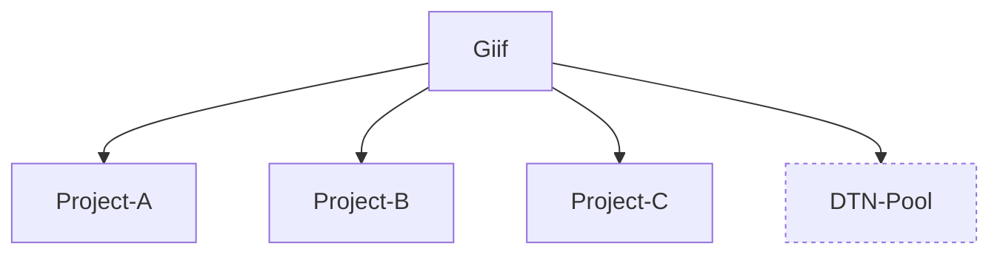

### Introduction to DTN

- `GridFTP` represents an adaptation of the File Transfer Protocol (FTP) specifically tailored for grid computing environments. This protocol, developed within the GridFTP working group of the Open Grid Forum, aims to deliver enhanced reliability and superior performance in file transfers, making it particularly suitable for the transmission of massive datasets. GridFTP has gained widespread adoption within large-scale scientific projects like the Large Hadron Collider, as well as in numerous supercomputer centers and other scientific facilities. Various implementations of the protocol exist, with the [Globus Toolkit](https://en.wikipedia.org/wiki/Globus_Toolkit) offering the most prominent implementation. Source: [Wikipedia](https://en.wikipedia.org/wiki/GridFTP)

  `See also:` Similar tools, such as [FDT (Fast data Transfer)](http://monalisa.cern.ch/FDT/documentation_syssettings.html), are described in this [paper](https://www.osti.gov/servlets/purl/1566967). 
 
- The Energy Sciences Network (`ESnet`) is a high-speed computer network designed to meet the needs of United States Department of Energy (DOE) scientists and their outside partners. Administered by the team at the Lawrence Berkeley National Laboratory, ESnet provides direct connections to over 40 DOE Office of Science labs and research sites. ESnet also links external research and commercial networks, allowing DOE scientists to have world-wide collaboration with people involved in related research and other topics of interest. Source: [Wikipedia](https://www.es.net/about/), [ESnet](https://www.es.net/about/) 

- `Science DMZ` refers to a computer subnetwork designed to maintain overall security but without any performance constraints imposed by the use of stateful firewalls. The term was coined by collaborators at the US Department of Energy's ESnet in 2010. Its main goal is to handle high volume data transfers, typical with scientific and high-performance computing. It is commonly deployed at or near the local network perimeter, and is optimized for a moderate number of high-speed flows, rather than for general-purpose or enterprise computing.

  The main components of a Science DMZ include:

  - A high performance Data Transfer Node (`DTN`) running parallel data transfer tools (e.g., GridFTP).
  - A network performance monitoring host, such as perfSONAR.
  - A high performance router/switch.

  Optional Science DMZ components are:

  - Support for layer-2 Multiprotocol Label Switching (MPLS) Virtual Private Networks (VPN).
  - Support for Software Defined Networking (SDN).

  `Note:` It's crucial to ensure that your host is optimally tuned for maximum TCP performance on the WAN. Confirm that _htcp_ or _cubic_, not _reno_, is the default TCP congestion control algorithm, and that the maximum TCP buffers are sufficiently large for your paths of interest. For more information see the [Host Tuning Section](https://fasterdata.es.net/host-tuning/).

    Source: [Wikipedia](https://en.wikipedia.org/wiki/Science_DMZ_Network_Architecture), [ESnet](https://fasterdata.es.net/science-dmz/)

### Using this framework as a DTN platform

- The usual DTN workflow includes:

  - Scheduling tests, often through tools like Google Calendar.
  - Creating a local user and configuring its public SSH key.
  - Collecting IP source addresses for securing SSH access with Access Control Lists (ACLs).
  - Executing the tests.
  - Deleting ACLs, the local SSH account, and server storage once the tests are complete.

    ```mermaid
    graph LR;
    User-->Network;
    Network-->SSH; 
    SSH-->Keys;
    ```

  `Note:` A DTN server is a `purpose-specific` rather than a `bare-metal` one.

    There are many different ways in which this framework can be used: 

    ```mermaid
    graph LR;
    User-->Network["Network (WireGuard and PPTP)"];
    Network-->SSH; 
    SSH-->Keys;
    SSH-->Passwords;
    Network-->RDP;
    Network-->Telnet;
    Network-->FTP;
    Network-->HTTP/HTTPS;
    Network-->ETC1["etc..."];
    User-->OOB;
    OOB-->VGA["VGA over HTTPS"];
    VGA-->Firmware;
    Firmware-->BIOS;
    Firmware-->RAID["RAID setup"];
    Firmware-->NIC["NIC setup"];
    Firmware-->ETC2["etc..."];
    OOB-->Power["Power Actions"];
    Power-->On;
    Power-->Off;
    Power-->Cycle;
    Power-->Reboot;
    OOB-->ISO["Virtual CD/DVD"];
    ISO-->Ubuntu["Ubuntu-20.04-LTS-SE.iso"];
    ISO-->CentOS["Centos-7.x-NetInstall.iso"];
    ISO-->NST["NST34.iso"];
    ISO-->Windows["Windows-Server-2022.iso"];
    ISO-->ETC3["etc..."];  
    ```

- In addition to the above, Guacamole's support for SSH connections can also be put into service.

### Hosting DTN servers within this framework

- **Motivation.** The goal is to overcome the limitations of relying on somewhat primitive static ACLs for protection, which can make accessing the service more difficult or even impossible in certain scenarios. The framework aims to offer more flexible access to DTN servers by leveraging its VPN and utilizing Guacamole's SSH proxying features. Additionally, the framework addresses the challenge of user isolation from the machine in a manner that doesn't compromise performance.

- **The default route dilemma.** In a typical BMS setup, the default route is configured on the project-management port. However, for a DTN server, the default gateway needs to be set on the high-performance (i.e., data transfer) port. Following the Science DMZ architecture, this port will be directly attached to an Internet-routable (i.e., public) subnet. To prevent potential end-user misuses, such as ARP Spoofing, on this public segment, it's essential to restrict end-user accounts to a non-privileged (i.e., non-root) set of commands.

- The diagram below illustrates a DTN service integrated within this framework. The key distinction between a typical project and the "DTN-Pool" project is that the latter is exclusively owned and managed by us. In other words, there are no third-party project owners; instead, the framework operators oversee everything—from VPN, Guacamole-SSH proxying, OS installation, and non-root accounts to the types of actions these may take.


- Key design points:

  - **Connectivity Rule:** Never attach hosts (VMs, BMS, containers) belonging to different (unrelated) groups of users to the same broadcast segment directly.
  - **DTN Access Control Challenge:** The traditional approach of "non-root SSH access restricted with static ACLs" is not flexible enough and often requires manual labor to manage access effectively.
  
- In special circumstances, unrestricted root access to a DTN server can still be granted to individuals considered "people of trust." 

- An alternative approach involves breaking up the public subnet into several /30 or even /31 point-to-point links.

  `Note:` For \31 subnets please check RFC 3021; on Linux, the relevant command might look something like:
  ```
  ip address add dev p2piface0 100.64.111.18 peer 100.64.111.17
  ```

- To restrict users, they can be placed within a container (following the idea borrowed from the PAGW templating). This approach addresses the default route problem, as it involves different routing tables in two distinct namespaces. Docker provides the necessary L2 connectivity drivers (Proxmox may also assist with LXC provisioning, although this hasn't been tried yet). The goal is to prevent users from having root privileges within these containers, as it would otherwise enable them to install certain packages (e.g., Apache web servers for general-purpose hosting on the Internet) or make low-level networking configurations that may impact other users on that public segment (e.g., various types of ARP and IP spoofing).

- Docker comes with several default networking drivers that form the core of its networking functionality:

    - [ ] `none` - disabled networking 
    - [ ] `bridge` - the default based on the Linux native bridging but not suitable for DTN because of NAT 
    - [ ] `overlay` - used for L2 networks that spread across multiple Docker hosts, not relevant for our use-case
    - [ ] `host` - no isolated namespace; too open as it binds to every host interface
    - [x] `macvlan` - a good candidate for the assignment of the data-transfer ports
    - [x] `ipvlan` - another good candidate, very similar to `macvaln`  
    
  Macvlan enables the configuration of sub-interfaces (so-called "slave devices") on a parent physical Ethernet interface (also known as the "upper device"). Each sub-interface has its unique MAC address and, consequently can get its IP own address. This allows VMs, containers and other applications to bind to a specific sub-interface, connecting directly to the physical network using their own MAC and IP addresses.

  While Macvlan is a nearly ideal solution for directly connecting VMs and containers to a physical network, it has its drawbacks:

  - The networking port must support "promiscuous mode," allowing one physical interface to be assigned multiple MAC addresses.
  - Switches may have policies limiting the number of different MAC addresses on a physical port. Changing this policy may not always be possible.
  - Many NICs have a limit on the number of MAC addresses they support in hardware. Exceeding the limit may impact the performance.
  - IEEE 802.11 doesn't favor multiple MAC addresses on a single client, and wireless interfaces may block macvlan sub-interfaces. Workarounds exist but opting for a simpler solution is often advisable.

  When you create a macvlan network, it can either be in bridge mode or 802.1q trunk bridge mode:

  - [x] In bridge mode, macvlan traffic goes through a physical device on the host.
  - [ ] In 802.1q trunk bridge mode, traffic goes through an 802.1q sub-interface which Docker creates on the fly. 

  Ipvlan is similar to macvlan, with a crucial difference: ipvlan doesn't assign unique MAC addresses to sub-interfaces. Instead, all sub-interfaces share the parent interface's MAC address while having distinct IP addresses. However, shared MAC addresses in ipvlan come with some general drawbacks:

  - DHCP operations can be affected by shared MAC addresses. If VMs or containers use DHCP, ensure they have a unique ClientID in the DHCP request, and configure the DHCP server to assign IP addresses based on the ClientID rather than the client's MAC address.
  - Autoconfigured EUI-64 IPv6 addresses are derived from the MAC address. Therefore, all VMs or containers sharing the same parent interface will auto-generate the same IPv6 address.

  `Note:` The use of /31 subnets on our 10/100 Gbps interfaces renders these shortcomings irrelevant.

  Ipvlan offers two modes of operation:

  - [x] Ipvlan L2 or Layer 2 mode, analogous to macvlan bridge mode.
  - [ ] Ipvlan L3 or Layer 3 mode serves as a Layer 3 device (router) between sub-interfaces and the parent interface. Each sub-interface must be configured with a different subnet. It does not, however, reduce the TTL value of the passing packets nor it does support dynamic routing protocols.

  Source: [Macvlan vs Ipvlan](https://hicu.be/macvlan-vs-ipvlan).

  An example command:

  ```
  docker network create -d macvlan --subnet=10.0.0.0/24 --ip-range=10.0.0.0/25 --gateway=10.0.0.1 -o parent=eth0 my-macvlan
  ```

  `Note:` Can we use [/31 subnets](https://github.com/moby/moby/issues/32444) with macvlan and ipvlan drivers in Docker?

- Adapting a BMS for the DTN role:

  - The server has been enrolled and is now part of the dedicated DTN project.
  - Make sure that public interface is connected and its MAC address is displayed in Guacamole. For example:
    ```
    [beta-bms0, Mgmt: 44:A8:42:09:D7:D0, Pub: 44:A8:42:09:D7:D1]
    ``` 
  - Reboot the server and setup the RAID (if available). 
  - Attach the Ubuntu 22.04 SE ISO image and start the installation process.
  - Add static IPv4 configuration (e.g., `192.168.212.201/24, def. gateway: 192.168.212.1`) to the proj. management port.     
  - Disable IPv4 and IPv6 on all remaining ports.
  - Write down the name of the public interface. Use its MAC address to identify it (e.g., `eno2 has 44:A8:42:09:D7:D1`). 
  - Create an operational "sudo" account as suggested by the installer. Feel free to use any username other than "dtn", as this one is reserved for a differnt user account.
  - Select an appropriate hostname (e.g., `beta-bms0-dtn`).
  - Ensure that both the OpenSSH server and the Snap packaging of Docker are installed on the server.
  - Once the installation is complete, remove the ISO, reboot and login to the server.
  - Upgrade the system and disable cloud-init as it is not needed:
   
    ```
    $ sudo apt-get update
    $ sudo apt-get -y dist-upgrade
    
    $ sudo systemctl disable cloud-init.service
    $ sudo systemctl disable cloud-config.service
    $ sudo systemctl disable cloud-final.service
    $ sudo systemctl disable cloud-init-local.service

    $ sudo reboot
    ```

  - Prepare the Docker environment (image and network):

    ```
    $ cd ~
    $ mkdir dtn-image/ 
    $ cd dtn-image/

    $ cat << 'EOF' > Dockerfile
    FROM ubuntu:22.04

    ARG DTN_USER 
    ENV DTN_USER=${DTN_USER:-dtn} 

    ARG DEBIAN_FRONTEND=noninteractive

    RUN useradd -m -s /bin/bash ${DTN_USER} && \
    apt-get update && \
    apt-get -y install vim nano mc wget iproute2 traceroute nmap curl && \
    apt-get -y install iperf iperf3 nuttcp && \
    apt-get -y install globus-gridftp-server-progs globus-gass-copy-progs && \
    apt-get -y install default-jre-headless && \
    wget http://monalisa.cern.ch/FDT/lib/fdt.jar -P /usr/share/java && \
    wget http://monalisa.cern.ch/FDT/scripts/fdtServer.sh http://monalisa.cern.ch/FDT/scripts/fdtClient.sh -P /usr/local/bin && \
    chmod +x /usr/local/bin/fdt*.sh && \
    sed -i 's|fdt.jar|/usr/share/java/fdt.jar|' /usr/local/bin/fdt*.sh 
    
    WORKDIR /home/$DTN_USER
    EOF
       
    $ sudo docker build -t dtn .  

    $ sudo docker network create -d macvlan \
                    --subnet=198.51.100.0/24 \
                    --ip-range=198.51.100.17/32 \
                    --gateway=198.51.100.1 \
                    -o parent=eno2 dtn-public-net
    ```      
        
    The `198.51.100.17` address used in the script above represents the public IP adress on which this DTN container will run. Make sure to replace the entire IP configuration above with the actual values used in your environment. 

  - Create a user named "dtn" and configure it as follows:

    ``` 
    $ sudo adduser --shell /bin/bash --disabled-password --gecos '' dtn
    
    $ sudo su 
    # su - dtn

    $ cat << 'EOF' > /home/dtn/dtn.sh
    #!/bin/bash

    sudo /snap/bin/docker run --network=dtn-public-net --user dtn -it --rm dtn /bin/bash
    EOF
       
    $ chown dtn:dtn /home/dtn/dtn.sh
    $ chmod 700 /home/dtn/dtn.sh
    
    $ mkdir /home/dtn/.ssh/
    $ chown dtn:dtn /home/dtn/.ssh/
    $ chmod 700 /home/dtn/.ssh/

    $ touch /home/dtn/.ssh/authorized_keys
    $ chown dtn:dtn /home/dtn/.ssh/authorized_keys
    $ chmod 600 /home/dtn/.ssh/authorized_keys 
    ```
      
    Run the `visudo` command as the root and append the following line (which must match the `/home/dtn/dtn.sh`):

    ```
    dtn ALL=(ALL) NOPASSWD:/snap/bin/docker run --network=dtn-public-net --user dtn -it --rm dtn /bin/bash
    ```  

    Make sure to change the shell for the "dtn" to `/home/dtn/dtn.sh`. 

    ```
    # usermod -s /home/dtn/dtn.sh dtn
    ```
       
    After switching to the "dtn" account, you should find yourself within a container:

    ```
    # su - dtn
    dtn@0f32e0922cee:~$ 
    ```

- Enabling VPN access:

  - A VPN (WireGuard or PPTP) account on the dedicated DTN project must be set.
  - The user's public SSH key needs to be appended to the `/home/dtn/.ssh/authorized_keys` on the targeted BMS.
  - Share the IP address of the targeted node (e.g., `192.168.212.201`) with the end-user. 
    
  Once the VPN connection is established, the SSH command should look something like the following:
        
  ```
  ssh -i my_priv_ssh.key dtn@192.168.212.201
  ```
- Enabling Guacamole access:

  - First, make the adjustments on the PAGW instance:

    - Login as the `pagw` user.
    - Create a separate user account for each DTN in your setup. For instance:
      ```
      sudo adduser --shell /bin/bash --disabled-password --gecos '' beta-bms0
      ``` 
    - Update `/etc/hosts` file with the corresponding entries:
      ```
      192.168.212.201       beta-bms0
      ``` 
    - Generate an SSH key-pair for the user:
      ```
      $ sudo su - beta-bms0
      $ ssh-keygen -t rsa
      ```
    - Append the public key generated in the previous step to the `/home/dtn/.ssh/authorized_keys` on the relevant DTN server (e.g., `beta-bms0`), and test if non-interactive and passwordless SSH connectivity from PAGW is possible:
      ```
      $ ssh -o 'UserKnownHostsFile=/dev/null' -o 'StrictHostKeyChecking=no' -i /home/beta-bms0/.ssh/id_rsa dtn@beta-bms0
      ``` 
    - Quit the previous SSH session and create a script that will become the new login shell for the user:
      ```
      $ cat << 'EOF' > /home/beta-bms0/beta-bms0.sh
      #!/bin/bash

      ssh -o 'UserKnownHostsFile=/dev/null' -o 'StrictHostKeyChecking=no' -i /home/beta-bms0/.ssh/id_rsa dtn@beta-bms0
      EOF

      $ chmod 700 /home/beta-bms0/beta-bms0.sh
      ``` 
    - Generate an additional SSH key-pair for the Guacamole connection, if you don't have one already. Add the public key to the `.ssh/authorized_keys` file. The private key will be added to the Guacamole setup in a later step:
      ```
      $ chown beta-bms0:beta-bms0 /home/beta-bms0/.ssh/authorized_keys 
      ```
    - Run the following as the root user in order to change the shell for the DTN user: 
      ```
      # usermod --shell '/home/beta-bms0/beta-bms0.sh' beta-bms0
      ``` 
    - Switching back to the DTN user should place you directly within a container:
      ```
      # su - beta-bms0
      dtn@0f32e2a37fec:~$ 
      ```
  - Next, create a Guacamole SSH connection as follows:
    - Edit connection:    
      - Name: **[DTN node beta-bms0 on 198.51.100.17]**
      - Location: **(Resources group under your DTN project)**
      - Protocol: **SSH** 
    - Guacamole Proxy Parameters (guacd)
      - Hostname: **guacd** 
      - Port: **4822** 
    - Parameters
      - Network
        - Hostname: **Public IP address of the PAGW instance allocated for the DTN project**
        - Port: **22**
      - Authentication
        - Username: **beta-bms0**
        - Private key: **(used on the PAGW instance)**
  - Add view permissions for this connection to the approprate set of registered Guacamole users.

- The outlined procedures have undergone successful testing, and further automation through scripting is a viable option.
